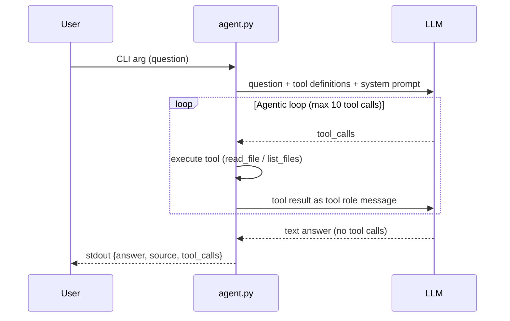

# Agent Documentation — Task 2

## Overview

Documentation agent with tools (`read_file`, `list_files`) and an agentic loop to navigate the project wiki and answer questions with source references.

## Architecture

```
User Input → agent.py → Agentic Loop → LLM API → Tool Execution → JSON Output
```

### Agentic Loop Flow



## LLM Provider

- **Provider**: Qwen Code API (self-hosted on VM)
- **Model**: `qwen3-coder-plus`
- **API Endpoint**: `http://10.93.25.242:42005/v1`

## Configuration

- API key and settings stored in `.env.agent.secret`
- Required variables: `LLM_API_KEY`, `LLM_API_BASE`, `LLM_MODEL`

## Tools

### read_file

Read a file from the project repository.

**Parameters:**
- `path` (string, required) — Relative path from project root (e.g., `wiki/git-workflow.md`)

**Returns:** File contents as a string, or an error message if the file doesn't exist.

**Example:**
```json
{"tool": "read_file", "args": {"path": "wiki/git-workflow.md"}}
```

### list_files

List files and directories at a given path.

**Parameters:**
- `path` (string, required) — Relative directory path from project root (e.g., `wiki`)

**Returns:** Newline-separated listing of entries (directories first, then files).

**Example:**
```json
{"tool": "list_files", "args": {"path": "wiki"}}
```

## Path Security

Both tools implement path security to prevent directory traversal attacks:

1. **Reject absolute paths** — Only relative paths from project root are allowed
2. **Reject `..` traversal** — Paths containing `..` are blocked
3. **Verify containment** — Resolved path must be within project directory
4. **Graceful errors** — Security violations return error messages instead of raising exceptions

## System Prompt Strategy

The system prompt instructs the LLM to:

1. Use `list_files` to discover wiki files when needed
2. For Git-related questions, check files in order: `git.md`, `git-vscode.md`, `git-workflow.md`, `github.md`
3. Use `read_file` to read specific files and find answers
4. If the first file doesn't contain the answer, try reading other related files
5. Always include a source reference in the final answer
6. Stop calling tools once the answer is found
7. Never exceed 10 tool calls

**System Prompt:**
```
You are a documentation assistant for a software engineering toolkit.
You have access to a project wiki with documentation files.

Your task is to answer user questions by searching the wiki files.

Available tools:
1. list_files - List files and directories at a given path
2. read_file - Read contents of a specific file

Strategy:
1. Use list_files to discover what files exist in the wiki directory
2. For Git-related questions, check these files in order: git.md, git-vscode.md, git-workflow.md, github.md
3. Use read_file to read specific files and find the answer
4. If you don't find the answer in the first file, try reading other related files
5. Once you find the answer, provide it with a source reference

Source reference format:
- Include the file path and section anchor (e.g., wiki/git-workflow.md#resolving-merge-conflicts)
- If no specific section, just use the file path (e.g., wiki/git-workflow.md)

Important rules:
- Always include a source field in your final answer
- The source should point to the exact file (and section if applicable) where the answer was found
- Stop calling tools once you have found the answer
- Do not make up information - only use information from the wiki files
- If the first file you read doesn't contain the answer, try other related files

When providing your final answer, structure it like this:
ANSWER: <your answer here>
SOURCE: <file_path>#<section_anchor> or <file_path>
```

## Usage

```bash
uv run agent.py "How do you resolve a merge conflict?"
```

## Output Format

```json
{
  "answer": "Edit the conflicting file, choose which changes to keep, then stage and commit.",
  "source": "wiki/git-workflow.md#resolving-merge-conflicts",
  "tool_calls": [
    {
      "tool": "list_files",
      "args": {"path": "wiki"},
      "result": "git-workflow.md\n..."
    },
    {
      "tool": "read_file",
      "args": {"path": "wiki/git-workflow.md"},
      "result": "..."
    }
  ]
}
```

### Fields

- **answer** (string, required) — The LLM's text answer to the question
- **source** (string, required) — Wiki section reference (e.g., `wiki/git-workflow.md#resolving-merge-conflicts`)
- **tool_calls** (array, required) — All tool calls made during the agentic loop
  - **tool** (string) — Tool name (`read_file` or `list_files`)
  - **args** (object) — Arguments passed to the tool
  - **result** (string) — Tool execution result

## Error Handling

- **Tool errors** — Return error message as tool result, continue loop
- **LLM errors** — Log to stderr, return error JSON
- **Max iterations (10)** — Stop looping, use whatever answer is available
- **Path security violations** — Return error message, don't execute tool
- **File not found** — Return error message as tool result

## Exit Codes

- `0` — Success
- `1` — Error (logged to stderr)

## Timeout

- 60-second timeout for LLM API calls
